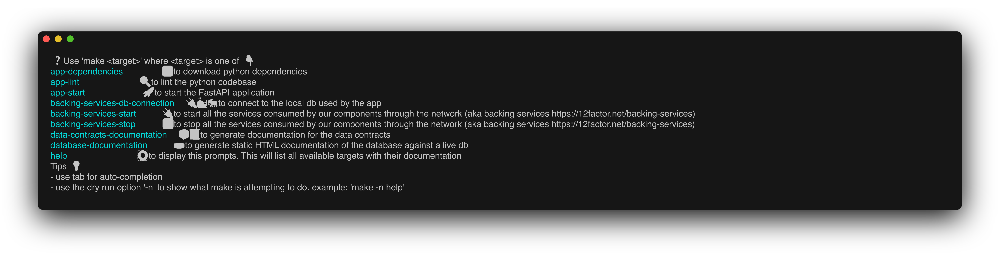

# living-documentation-cookbook

A companion repo to my blog article

## Requirements

- [charmbracelet/freeze](brew install charmbracelet/tap/freeze
) : to create documentation from commands output

## Getting started

Run `make` or `make help` :

```sh
make;
```

It will list the available commands, and update the following image 👇


