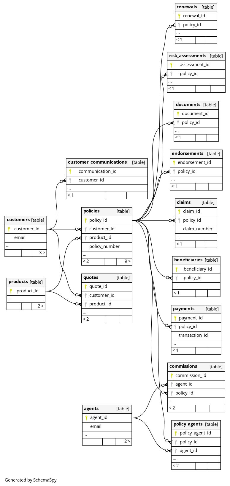

# living-documentation-cookbook

A companion repo to my blog article

## Requirements

- 📸 [charmbracelet/freeze](https://github.com/charmbracelet/freeze) : to create documentation from commands output
- 🐳 [docker-compose](https://docs.docker.com/compose/install/) : to be able to run containers locally

## Getting started

Run `make` or `make help` 🔥

## Documentation

### Documenting usages

Run `make` or `make help` in your terminal, or straight from this markdown file if your IDE allows it :

```sh
make;
```

This command will list the available commands, and it will also update the following image 👇


## Documenting the database



Generate and update this schema with :

```bash
make database-documentation;
```
