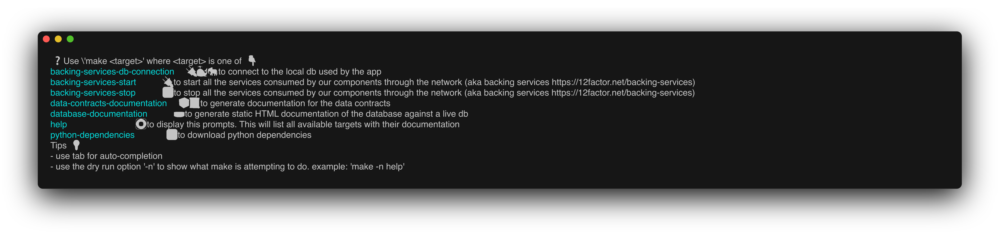

# living-documentation-cookbook

A companion repo to my blog article

- [living-documentation-cookbook](#living-documentation-cookbook)
  - [Requirements](#requirements)
  - [Getting started](#getting-started)
  - [Documentation](#documentation)
    - [Documenting usages](#documenting-usages)
      - [How does it work](#how-does-it-work)
    - [Documenting the database](#documenting-the-database)
      - [How does it work](#how-does-it-work-1)
    - [Documenting the HTTP REST API](#documenting-the-http-rest-api)
      - [How does it work](#how-does-it-work-2)
    - [Document a data contract](#document-a-data-contract)
      - [How does it work](#how-does-it-work-3)


## Requirements

- 📸 [charmbracelet/freeze](https://github.com/charmbracelet/freeze) : to create documentation from commands output
- ⛳️ [GNU tee](https://tldr.inbrowser.app/pages/common/tee) : to pipe some logs in both STDOUT and other CLI tools (such as Freeze)
- 🐳 [docker](https://docs.docker.com/engine/install/) and [docker-compose](https://docs.docker.com/compose/install/) : to run containers locally
- 🐍 [Python](https://www.python.org/downloads/) : to run the sample FastAPI app and consult the dynamic OpenAPI (living) documentation
  - Take a look at [pyproject.toml](./coolcover_company/pyproject.toml) file to know what Python version is needed
- ⚡️ [uv](https://docs.astral.sh/uv/) : to handle Python dependency management

## Getting started

Run `make` or `make help` 🔥

## Documentation

### Documenting usages

Run `make` or `make help` in your terminal, or straight from this markdown file if your IDE allows it :

```sh
make;
```

This command will list the available commands, and it will also update the following image 👇



#### How does it work

- The self-documented Makefile is composed of a `help` target to parse itself
  - Each PHONY target accompanied with the `##` delimiter is used to print the documentation in the terminal
- A snapshot of the terminal is taken with Freeze CLI and included above

### Documenting the database


Generate and update this schema with :

```bash
make database-documentation;
```

#### How does it work

- With a containerized version of Schemaspy, like this :


### Documenting the HTTP REST API

Run the application with

```bash
make start-app
```

The API documentation will be automatically available at the following urls once the application is up :

|          OpenAPI rendering           |            ReDoc rendering             |
| :----------------------------------: | :------------------------------------: |
|      |          |
| [🔗 link](http://127.0.0.1:8000/docs) | [🔗  link](http://127.0.0.1:8000/redoc) |

#### How does it work

- This documentation is automatically rendered from how the API is modelled in the code, 
  - following [OpenAPI standard](https://swagger.io/specification/),
  - it is *living* at the same pace as the code is evolving.

### Document a data contract

For whatever reason, you may need to exchange `Departments` data with other teams without the REST API, through CSV flat files for example.

The JSON Schema specification can help define the interface contract between you and third parties (expected fields, constraints, etc ...) of the data you wille expose (or expected) through this file medium.

You can generate such a document from the code, with the following command:

```bash
make data-contract-docs;
```

and the resulting documentation should look like this :

|                                Departments data contract                                 |
| :--------------------------------------------------------------------------------------: |
|                                                     |
| [🔗 link](./docs/data_contracts/generated_docs/Departments/department_specification.html) |

#### How does it work

- A `Department` is modelled in the code as a `Pydantic BaseModel` object
- Pydantic's BaseModel offers a method to automatically map a Python class to a JSON Schema document
- The json-schema-for-humans library can map a JSON Schema document to a static HTML file


